# EE4108 Mini Project Report: Circularly Polarized Patch Antenna Design

**Author:** Azat Idayatov (58178204)  
**Date:** April 2026  
**Repository:** [GitHub - CP_Antenna_Design](https://github.com/Azat228/CP_Antenna_Design)

---

## 📡 Project Overview

This project presents the design, simulation, and analysis of a **circularly polarized (CP) microstrip patch antenna** operating in the 5.1–5.5 GHz frequency band. The antenna utilizes an **air substrate (foam board)** to minimize dielectric losses and overall thickness while maintaining robust CP performance.

---

## 🎯 Design Specifications

| Parameter | Requirement |
|-----------|-------------|
| Polarization | Circular Polarization (CP) |
| Frequency Range | 5.1 GHz – 5.5 GHz |
| VSWR | < 2 |
| Axial Ratio | < 3 dB |
| Radiation Pattern | Unidirectional (boresight) |
| Backlobe Level | < -15 dB |
| Gain (boresight) | > 5 dBic |
| Half-Power Beamwidth | > 30° at 5.3 GHz (both principal planes) |
| Cross-Polarization Discrimination | > 15 dB |
| Substrate Material | Air (foam board) |
| Substrate Thickness | Minimized |

---

## 🧠 Why Circular Polarization?

A **circularly polarized (CP) antenna** generates a wave in which the orthogonal electric and magnetic field components possess equal amplitudes and a 90° phase difference, causing the field vector to rotate as the wave propagates. In contrast, a **linearly polarized (LP)** wave oscillates along a single fixed plane.

### Key Advantages of CP over LP:
- **Robustness to orientation mismatch** – CP antennas maintain reliable communication regardless of transmitter/receiver alignment.
- **Multipath interference rejection** – Reflected waves reverse polarization sense and are naturally rejected.
- **Broader angular coverage** – More consistent signal reception over a wider range of incident angles.

#### Polarization Visualization

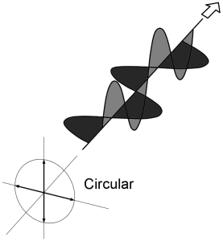

---

## 📐 Antenna Design

### Design Theory

A **microstrip patch antenna** is a planar radiator consisting of a metallic patch etched on a dielectric substrate above a ground plane. For circular polarization, we employ a **dual-feed square patch** configuration where two orthogonal ports are excited with a 90° phase shift.

#### Design Equations (Transmission Line Model)

The physical dimensions were calculated for a center frequency $f_0 = 5.3$ GHz, air substrate ($\varepsilon_r \approx 1.07$), and thickness $h = 4.0$ mm.

**Patch Width:**
$$W = \frac{c}{2 f_0} \sqrt{\frac{2}{\varepsilon_r + 1}}$$

**Effective Dielectric Constant:**
$$\varepsilon_{\text{eff}} = \frac{\varepsilon_r + 1}{2} + \frac{\varepsilon_r - 1}{2} \left( 1 + 12 \frac{h}{W} \right)^{-1/2}$$

**Length Extension (Fringing Fields):**
$$\Delta L = 0.412 h \cdot \frac{\left( \varepsilon_{\text{eff}} + 0.3 \right) \left( \dfrac{W}{h} + 0.264 \right)}{\left( \varepsilon_{\text{eff}} - 0.258 \right) \left( \dfrac{W}{h} + 0.8 \right)}$$

**Physical Length:**
$$L = \frac{c}{2 f_0 \sqrt{\varepsilon_{\text{eff}}}} - 2\Delta L$$

**Feed Offset from Center (for 50 Ω match):**
$$d = \frac{L}{\pi} \cdot \arccos\left( \sqrt{\frac{50}{R_{\text{edge}}}} \right)$$

where $R_{\text{edge}} \approx 250$ Ω.

### Calculated Parameters

| Parameter | Calculated Value |
|-----------|------------------|
| Target Frequency ($f_0$) | 5.3 GHz |
| Substrate Permittivity ($\varepsilon_r$) | 1.07 |
| Substrate Thickness ($h$) | 4.0 mm |
| Free-Space Wavelength ($\lambda_0$) | 56.6 mm |
| Patch Width ($W$) | 25.07 mm |
| Patch Length ($L$) | 25.07 mm |
| Ground Plane Size | 53.57 × 53.57 mm |
| Feed Offset from Center ($d$) | 8.84 mm |

*Note: Final dimensions were optimized in HFSS and differ slightly from calculated values.*

---

### Optimized Parameters (HFSS)

| Parameter | Value |
|-----------|-------|
| Patch Width ($W$) | 25 mm |
| Patch Length ($L$) | 25 mm |
| Air Substrate Thickness ($h$) | 4 mm |
| Feed Offset from Center | 8 mm |
| Ground Plane Width | 80 mm |
| Ground Plane Length | 80 mm |

#### Textbook Design Reference

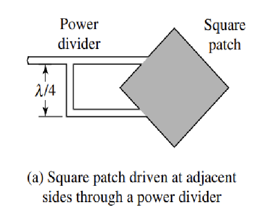

### HFSS Antenna Geometry

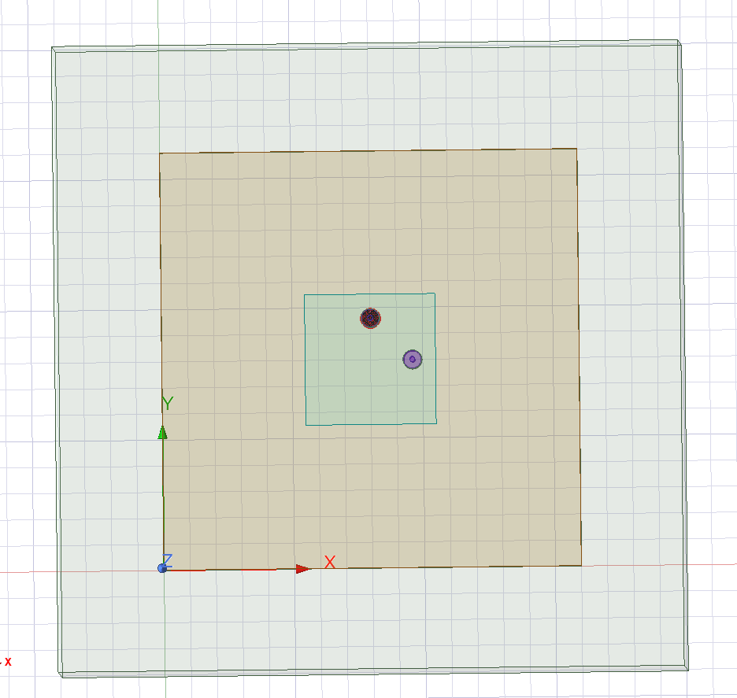

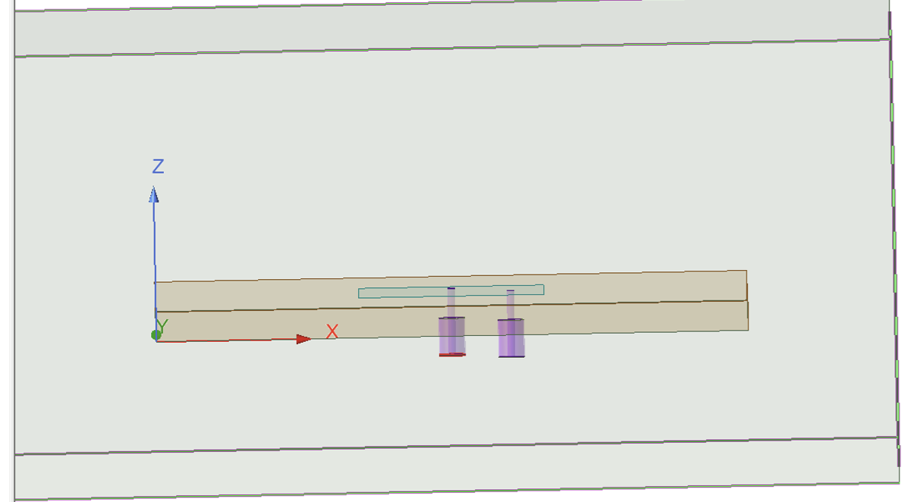

### Feeding Method

A **dual-feed configuration** with 90° phase difference excites two orthogonal modes, producing **Right-Hand Circular Polarization (RHCP)**:

$$\vec{E}(t) = E_0 \left[ \hat{x} \cos(kz - \omega t) + \hat{y} \sin(kz - \omega t) \right]$$

- **Port 1:** Integration line along **Y-direction**
- **Port 2:** Integration line along **X-direction**  
- **Phase Shift:** 90° (achieved through feed network)
- **Impedance:** 50 Ω
- **Input Power:** 1 W

---

## 📊 Simulation Results (ANSYS HFSS)

### VSWR (Voltage Standing Wave Ratio)

The VSWR characterizes impedance matching:

$$\text{VSWR} = \frac{1 + |\Gamma|}{1 - |\Gamma|}$$

where $\Gamma$ is the reflection coefficient.

- **Range:** 1.7 – 2.5 across 5.1–5.5 GHz
- *Upper bound slightly exceeds target (< 2), but acceptable for most applications.*

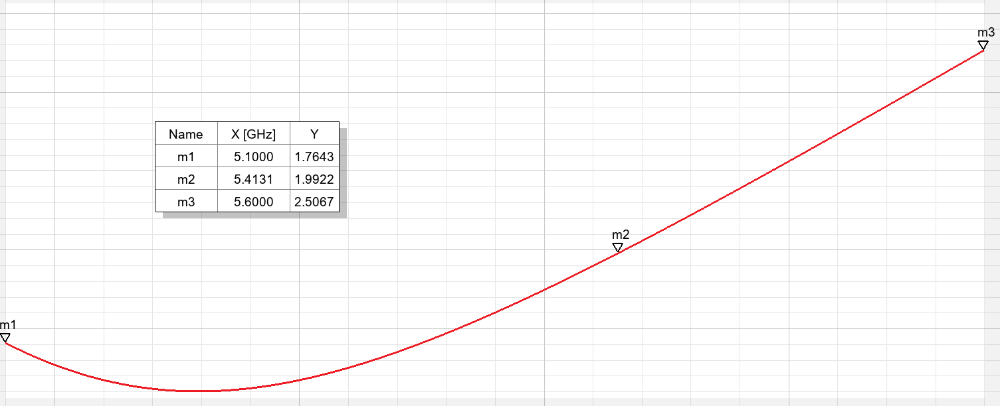

### Axial Ratio

The **Axial Ratio (AR)** defines the polarization purity:

$$\text{AR} = \frac{E_{\text{major}}}{E_{\text{minor}}}$$

An AR of 0 dB indicates perfect circular polarization, while 3 dB represents the critical threshold.

- **Range:** 2.5 – 3.2 dB across 5.1–5.5 GHz
- *Marginally above 3 dB at band edges, maintains predominantly CP characteristics.*

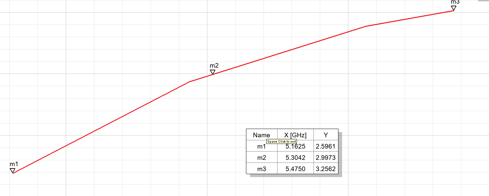

### Radiation Pattern & Backlobe Level

The radiation pattern exhibits strong boresight directivity with excellent backlobe suppression:

$$G(\theta, \phi) = \left| \sin(\theta) \right|^2$$

- **Backlobe Level:** -19.8 dB
- *Comfortably satisfies < -15 dB requirement.*

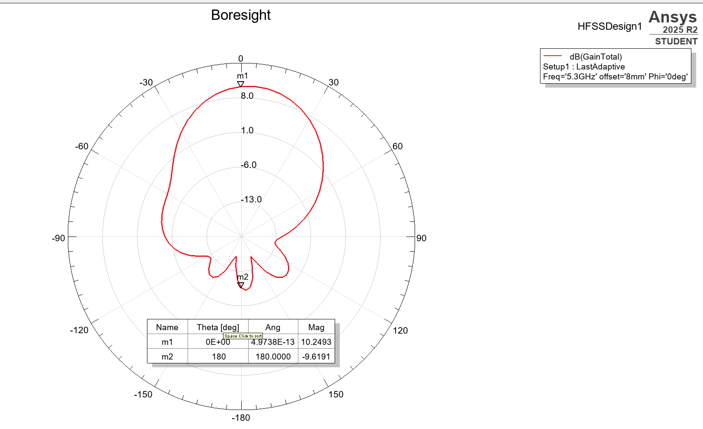

#### Boresight Patterns at Different Frequencies

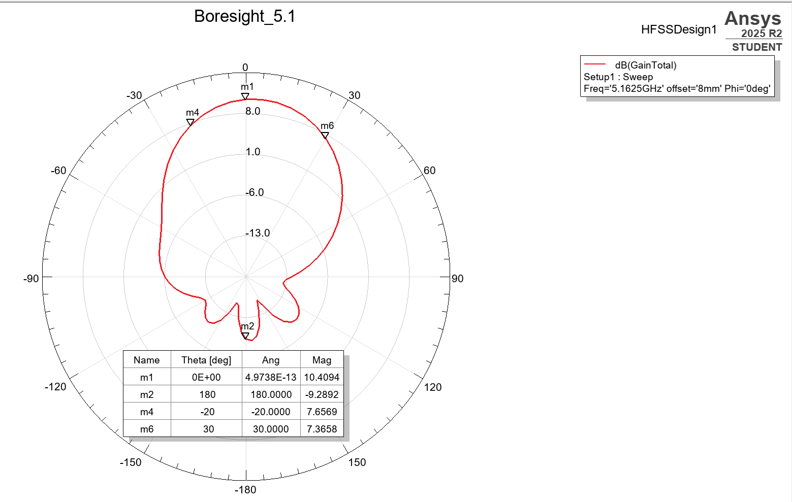

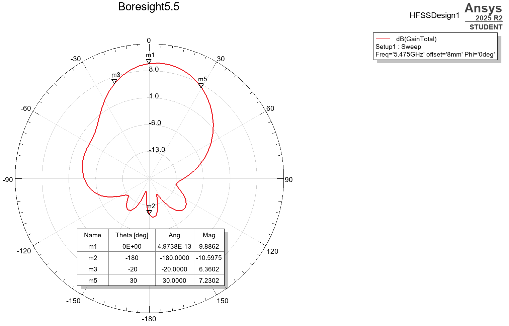

### Half-Power Beamwidth (HPBW)

The **HPBW** is the angular width of the main lobe at -3 dB points:

| Frequency | HPBW |
|-----------|------|
| 5.1 GHz | 50° |
| 5.3 GHz | 50° (E-plane) / 55° (H-plane) |
| 5.5 GHz | 50° |

*All values exceed the > 30° minimum requirement.*

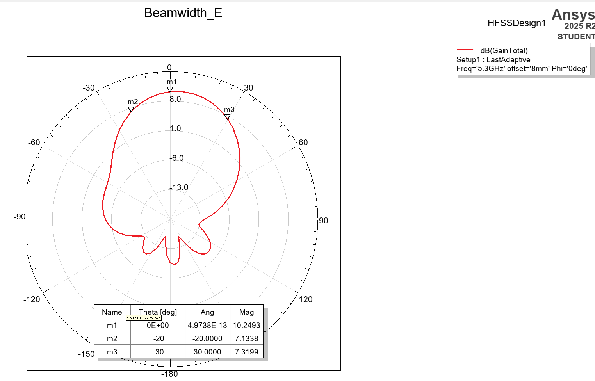

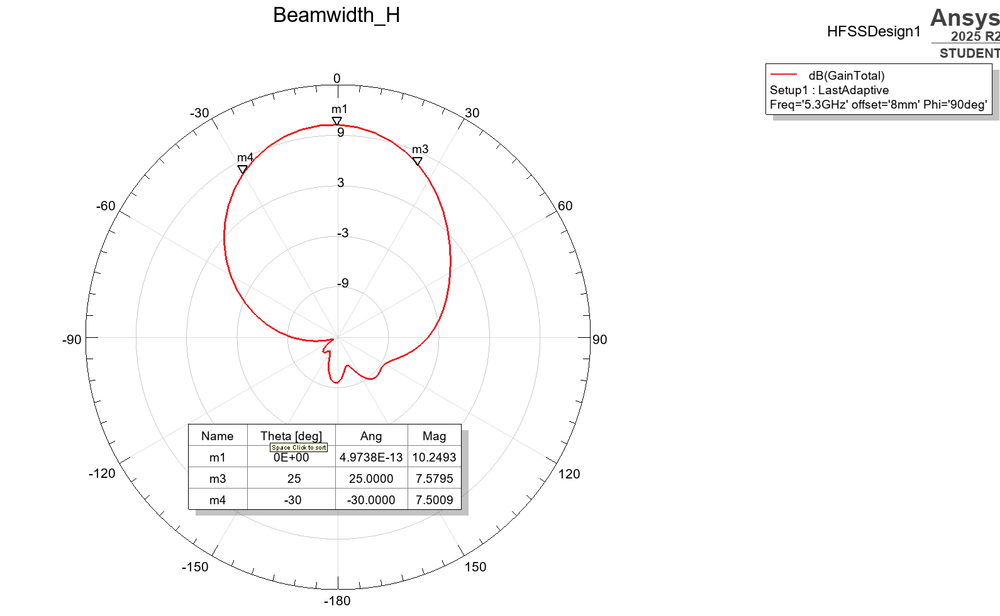

### Cross-Polarization Discrimination (XPD)

Cross-polarization accounts for unwanted orthogonal polarization components:

$$\text{XPD} = 20 \log_{10} \left( \frac{|E_{\text{co-pol}}|}{|E_{\text{cross-pol}}|} \right)$$

- **Measured:** 15.3 dB
- *Satisfies > 15 dB requirement.*

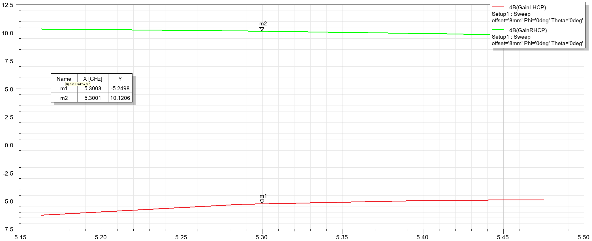

### Gain

The antenna gain relates radiated power intensity to an isotropic radiator:

$$G = \frac{4\pi}{\lambda^2} A_e$$

where $A_e$ is the effective aperture.

- **Range:** 9.88 – 10.4 dBic across the band
- *Exceeds > 5 dBic requirement.*

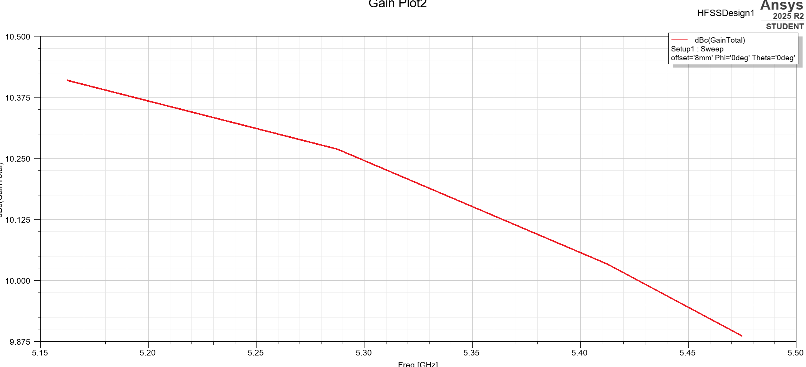

---

## 📈 Summary: Target vs. Simulated

| Parameter | Target | Simulated | Status |
|-----------|--------|-----------|--------|
| Frequency Range | 5.1–5.5 GHz | 5.1–5.5 GHz | ✅ Met |
| VSWR | < 2 | 1.7–2.5 | ⚠️ Slight deviation |
| Axial Ratio | < 3 dB | 2.5–3.2 dB | ⚠️ Slight deviation |
| Backlobe Level | < -15 dB | -19.8 dB | ✅ Met |
| Gain | > 5 dBic | 9.88–10.4 dBic | ✅ Exceeded |
| HPBW (E-plane) | > 30° | 50° | ✅ Exceeded |
| HPBW (H-plane) | > 30° | 55° | ✅ Exceeded |
| Cross-Polarization | > 15 dB | 15.3 dB | ✅ Met |

---

## ❌ Design Iterations & Unsuccessful Attempts

### Attempt 1: Corner-Truncated Single-Feed Method

The corner-truncated approach removes small portions from opposite corners to generate two slightly different mode frequencies, theoretically achieving CP through mode mixing.

**Issues Encountered:**
- Extremely narrow axial ratio bandwidth (only at 5.3 GHz)
- VSWR degradation across the band
- Impractical truncation sensitivity

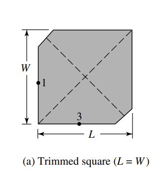

### Attempt 2: Nearly-Square Patch Method

This approach attempts to use a nearly-square patch with slightly different dimensions to excite quasi-orthogonal modes.

**Issues Encountered:**
- Unacceptably high axial ratio across the band
- Extreme sensitivity to dimensional tolerances
- Impractical for fabrication with foam board

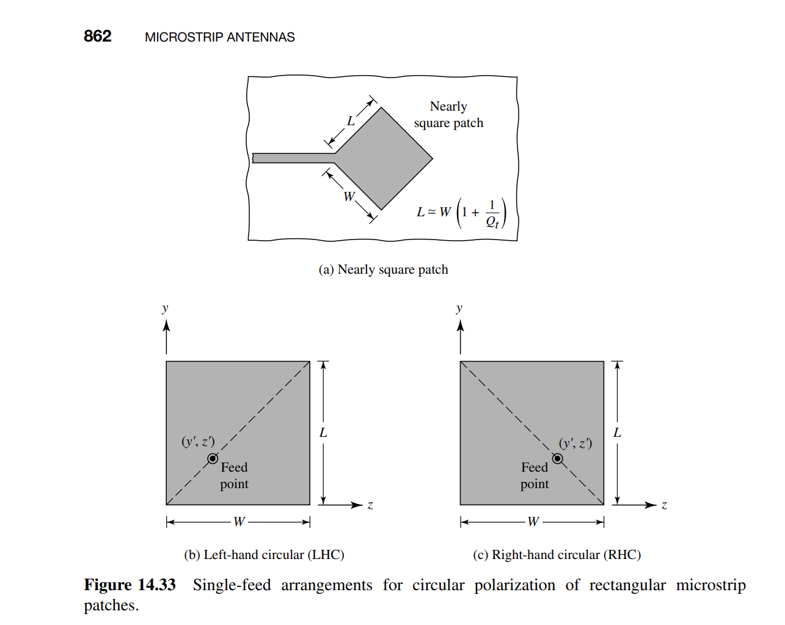

### Lessons Learned

Single-feed CP configurations suffer from:
- Narrow bandwidth characteristics
- High fabrication sensitivity
- Challenging impedance matching

The **dual-feed square patch** configuration offers:
- Broader bandwidth with superior axial ratio stability
- Greater robustness to manufacturing tolerances
- Simplified design optimization process
- Justifies slightly more complex feed arrangement

---

## 🛠️ Tools Used

- **ANSYS HFSS** – Full-wave electromagnetic simulation
- **MATLAB** – Auxiliary calculations and optimization
- **LaTeX** – Report preparation

